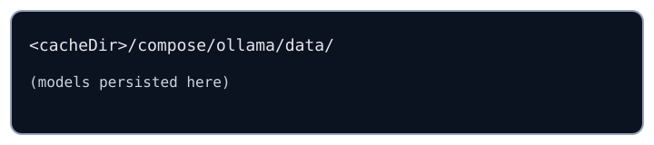

# Ollama

该应用用于给 Anya 提供 Ollama（本地推理服务），并通过 Docker Compose 管理。



Ollama 模型等持久化数据会挂载到 `./data`（宿主机目录，路径相对于 `docker-compose.yml` 所在目录）。

## 启动（本地 / 手工）

```bash
cd anya-appstore/apps/ollama/0.0.1
PANEL_APP_PORT_HTTP=11434 docker compose up -d
```

停止：

```bash
cd anya-appstore/apps/ollama/0.0.1
docker compose stop
```

