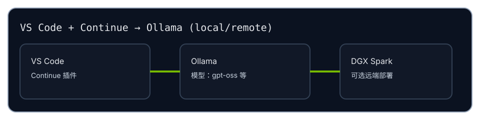

# Vibe Coding（Anya Client 使用说明 / 中文 Demo）

这是给 **Anya Client 用户/测试人员** 的说明：在 Anya 内启动 Ollama、在 Anya 内安装模型，然后在 VS Code 的 Continue 中把模型接上，实现 “Vibe Coding” 的体验。

## 你将获得什么

- 在 VS Code 里用 Continue 进行对话/编辑/补全（Continue 负责 UI）
- 模型服务由 **Anya 管理的 Ollama** 提供（Ollama 由 Anya 在固定缓存目录里通过 Compose 启动）
- 模型下载/管理在 Anya 的 `/models` 页面完成（无需手写 docker compose / 脚本）

## 前置条件

- Anya Client 已运行并可访问（例如 `http://127.0.0.1:8090`）
- Docker 可用（Anya 用 Compose 启动 Ollama）
- VS Code 已安装，并安装 Continue 插件
- 首次拉取模型需要联网（可能较慢）

接下来请按导航阅读：先在 Anya 中启动 Ollama + 拉取模型，再配置 Continue 连接到 `http://127.0.0.1:11434`（或你在 Anya 中设置的端口）。
